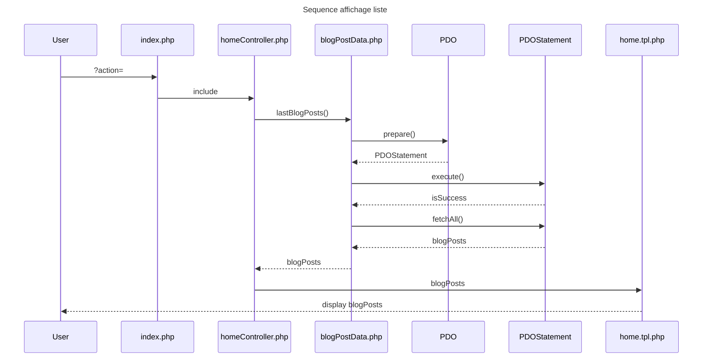
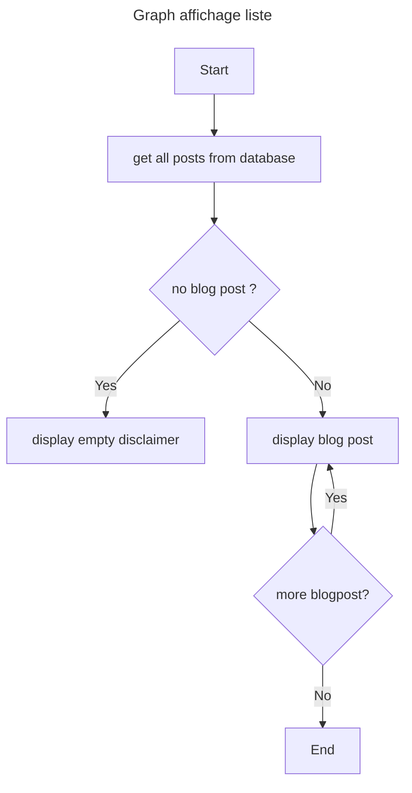
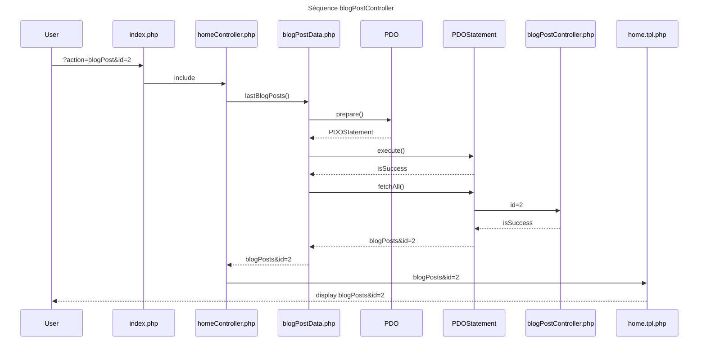
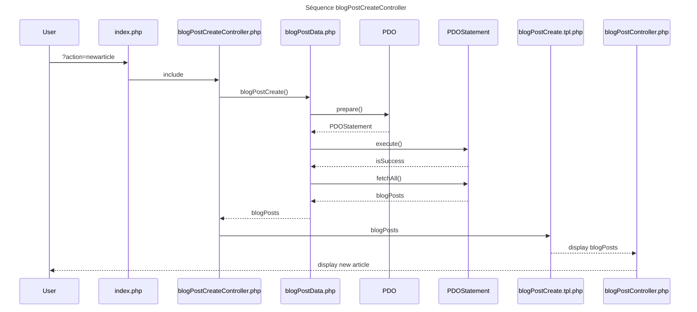

```mermaid
---
title : Sequence affichage liste
---
sequenceDiagram
User->>index.php: ?action=
index.php->>homeController.php: include
homeController.php->>blogPostData.php: lastBlogPosts()
blogPostData.php->>PDO: prepare()
PDO-->>blogPostData.php: PDOStatement
blogPostData.php->>PDOStatement: execute()
PDOStatement-->>blogPostData.php: isSuccess
blogPostData.php->>PDOStatement: fetchAll()
PDOStatement-->>blogPostData.php: blogPosts
blogPostData.php-->>homeController.php: blogPosts
homeController.php->>home.tpl.php: blogPosts
home.tpl.php-->>User: display blogPosts
```

```mermaid
---
title : Graph affichage liste
---
graph TD
A[Start] --> B[get all posts from database]
B --> C{no blog post ?}
C -- Yes --> D[display empty disclaimer]
C -- No --> E[display blog post]
E --> F{more blogpost?}
F -- Yes --> E
F -- No --> G[End]
```

```mermaid 
---
title : Séquence blogPostController
---
sequenceDiagram
    User->>index.php: ?action=blogPost&id=2
    index.php->>homeController.php: include
    homeController.php->>blogPostData.php: lastBlogPosts()
    blogPostData.php->>PDO: prepare()
    PDO-->>blogPostData.php: PDOStatement
    blogPostData.php->>PDOStatement: execute()
    PDOStatement-->>blogPostData.php: isSuccess
    blogPostData.php->>PDOStatement: fetchAll()
    PDOStatement->>blogPostController.php: id=2
    blogPostController.php-->>PDOStatement: isSuccess
    PDOStatement-->>blogPostData.php: blogPosts&id=2
    blogPostData.php-->>homeController.php: blogPosts&id=2
    homeController.php->>home.tpl.php: blogPosts&id=2
    home.tpl.php-->>User: display blogPosts&id=2
```

```mermaid
---
title : Séquence blogPostCreateController
---
sequenceDiagram
User->>index.php: ?action=newarticle
index.php->>blogPostCreateController.php: include
blogPostCreateController.php->>blogPostData.php:blogPostCreate()
blogPostData.php->>PDO: prepare()
PDO-->>blogPostData.php: PDOStatement
blogPostData.php->>PDOStatement: execute()
PDOStatement-->>blogPostData.php: isSuccess
blogPostData.php->>PDOStatement: fetchAll()
PDOStatement-->>blogPostData.php: blogPosts
blogPostData.php-->>blogPostCreateController.php: blogPosts
blogPostCreateController.php->>blogPostCreate.tpl.php: blogPosts
blogPostCreate.tpl.php-->>blogPostController.php: display blogPosts
blogPostController.php-->>User:display new article
```